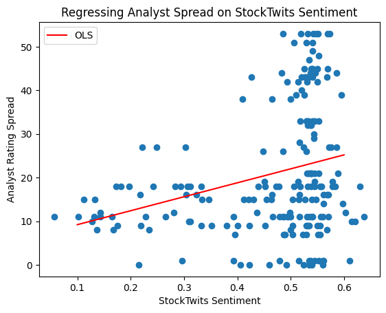

# Market Sentiment Analysis

A couple of years ago, I was following the GameStop saga, where online communities like Reddit’s WallStreetBets seemed to send stocks skyrocketing, catching even professional analysts by surprise. That story fascinated me and made me wonder: **Can retail investor sentiment truly move markets — and how does it relate to traditional analyst recommendations?**

This project grew from that curiosity. I wanted to explore whether social media sentiment data, like posts from StockTwits, holds real explanatory power alongside the opinions of Wall Street analysts.

## What I Tried to Accomplish

- Test the idea that social sentiment might carry signals useful for trading or analysis
- Quantify how much influence sentiment has on traditional Wall Street research
- Explore how sentiment data and analyst ratings move together — or don’t — over time
- Visualize insights so they’re easy to interpret and potentially actionable

## What I Learned

- There is a modest positive relationship between sentiment and analyst recommendations, but the effect size varies across different stocks
- Social sentiment is volatile and often spikes around news or viral online discussion, while analyst ratings are steadier

Dissecting the plot:

- The red OLS line shows a clear positive trend: as StockTwits sentiment increases, analyst spread (buy minus sell recommendations) also increases
  - This confirms our regression finding that retail sentiment and professional analyst opinions do move in the same direction
- The heavy clustering of data points in the higher sentiment range indicates that our dataset may be skewed toward more positive sentiment periods

## Takeaways and Assumptions

- Assumption: StockTwits sentiment data roughly represents the views of retail traders
- Assumption: Analyst recommendations reflect institutional thinking and move more slowly
- Takeaway: Social sentiment might offer early clues before formal analyst changes — but it’s noisy and sometimes misleading
- Takeaway: **The best use of sentiment data is as a complementary tool, not a standalone strategy**
- Limitation: Results depend on the specific time periods and tickers analyzed; a larger dataset along with sentiment ranges would help confirm findings

## Known Issues

- Some tickers had limited data, introducing noise into regressions
- Sentiment scoring methods can differ between platforms, making results less consistent

## Next Steps

- Expand the analysis across more stocks and longer timeframes
- Include price return analysis to connect sentiment and analyst calls to actual market performance
- Compare sentiment signals from other platforms like Reddit
- Investigate specific events (like earnings or news releases) to see how sentiment shifts relate to analyst reactions

## Final Note

This project was inspired by the realization that retail traders are no longer silent spectators. While social media sentiment isn’t enough to replace traditional analysis, it can offer valuable signals and context and I think it is a space worth watching as market dynamics evolve.
